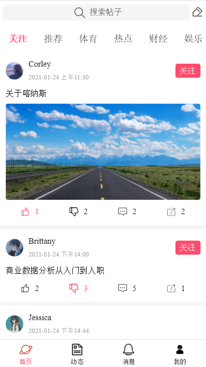
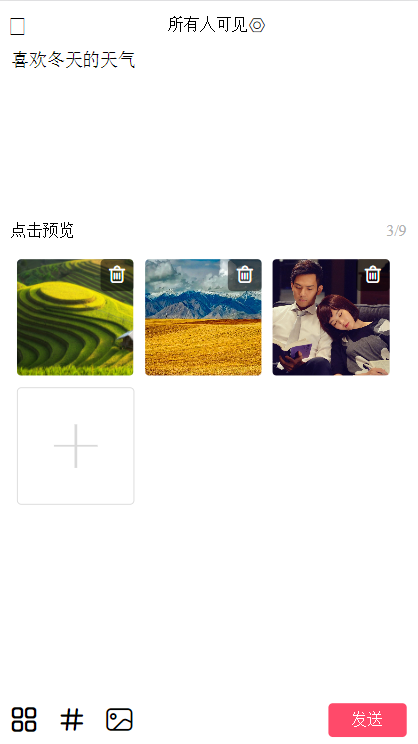
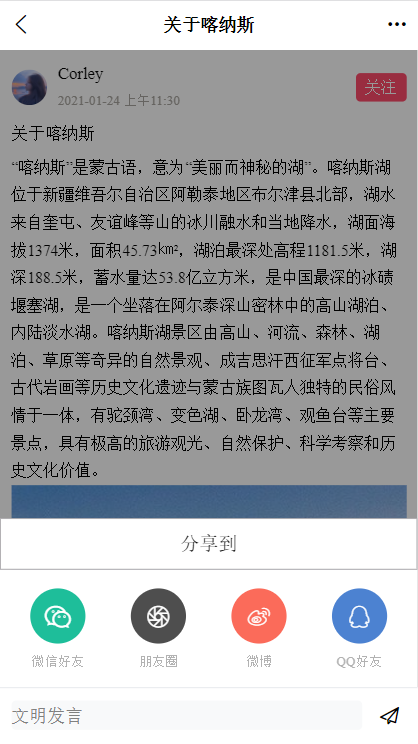
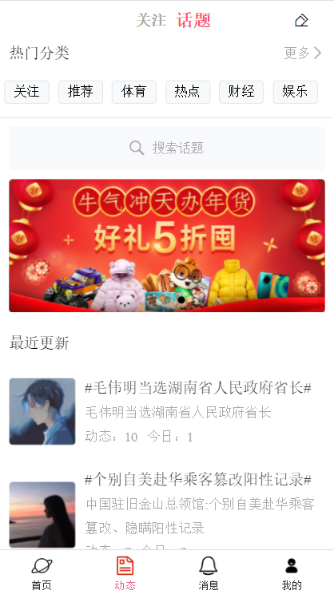
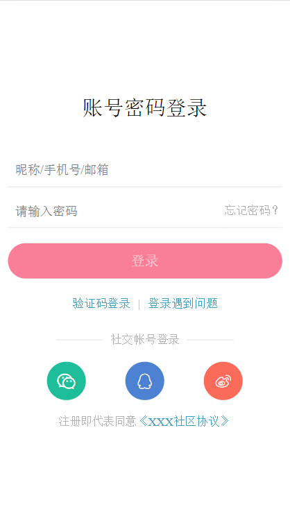
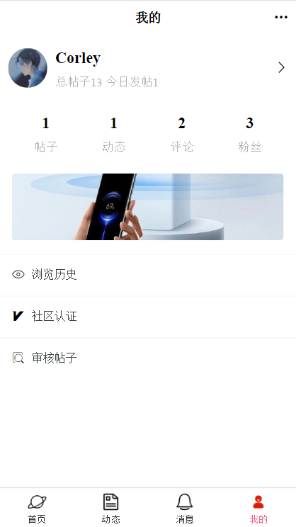
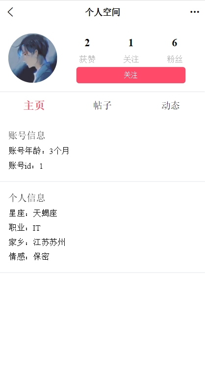
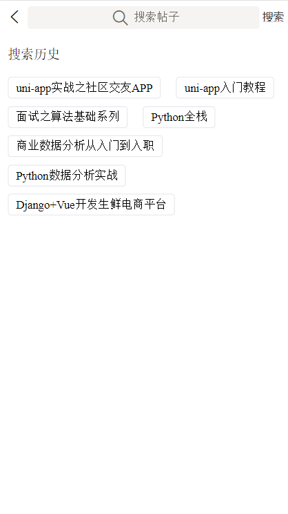
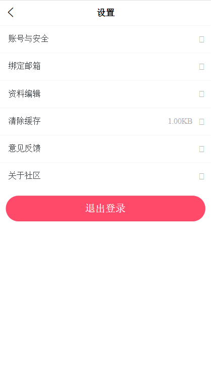
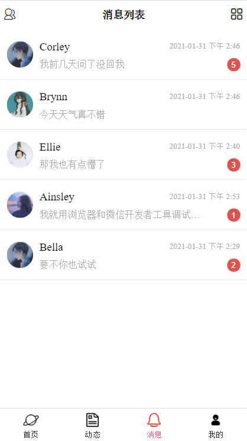

# markTime
## 项目介绍
本项目是基于uni-app，实战开发社区交友类app，实现一次开发、多端发布，同时发布到安卓端app、iOS端app、微信小程序和支付宝小程序等平台，其中后端接口采用Python Django实现。
项目中包含了帖子模块、话题模块、搜索模块、会员模块、聊天模块、广告位模块和其他模块等，最终实现了丰富的功能、美观的界面，部分界面示意如下：
## 部分截图

